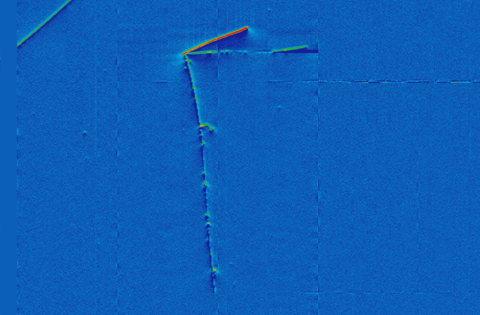
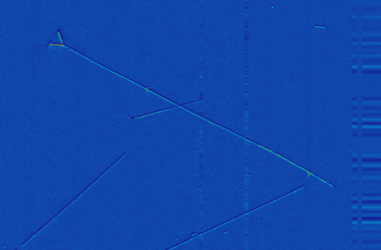
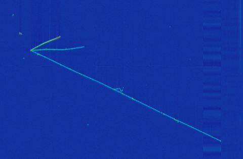
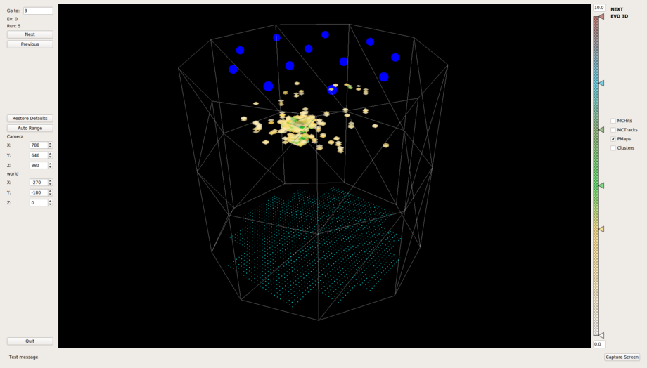

---
# Feel free to add content and custom Front Matter to this file.
# To modify the layout, see https://jekyllrb.com/docs/themes/#overriding-theme-defaults

title: Time Projection Chambers
order: 0
icon: none
<!-- icon: fa-flask -->
---

Time projection chambers are important detectors in high energy physics, both historically and recently with a modern re-emergence.  There are many good references on the <a href="https://en.wikipedia.org/wiki/Time_projection_chamber">history</a> and <a href="http://npc.fnal.gov/wp-content/uploads/2017/06/NuPhysSymposium_Asaadi.pdf">workings</a> of a time projection chamber.

The key advantage of modern time projection chambers is excellent spatial resolution and charge digitization.  Many of the liquid argon time projection chambers use wires to read out rifted charge, which compresses a 3D interaction into a 2D image.  However, the amplitude of each pixel in the 2D image tells a lot of information about the particles in the image. Below is one projection of the Microboone TPC showing a muon neutrino charged current interaction, with both a long muon track and shorter, hadronic tracks.  One of these tracks is much more ionizing than the others, indicating it's likely a proton.

The microboone TPC uses wires to read out it's drifted charge, giving multiple views of the same interaction.  In effect, you get three views: top down, from 60 degrees to the left, and 60 degrees to the right.  In the images below, you can see how one interaction (the same as above) is changed by the difference perspectives the wire plane TPC gives.

You can see that each view offers a unique view of the event.  In fact, based on this information and the geometry of the detector, you can infer from the images the path of the 3D particle interaction.

There is another style of TPC that uses pixel readouts instead of wire readouts.  For example, in the NEXT experiment, they have a dense 2D array of silicon photomultiplies spaced at 1cm pitch.  Combined with the drift time of an interaction, this gives natively 3D interaction information.

The interaction shown here is low energy, but you can see many distinct interaction sites from gamma rays, as well as the larger primary interaction site.

