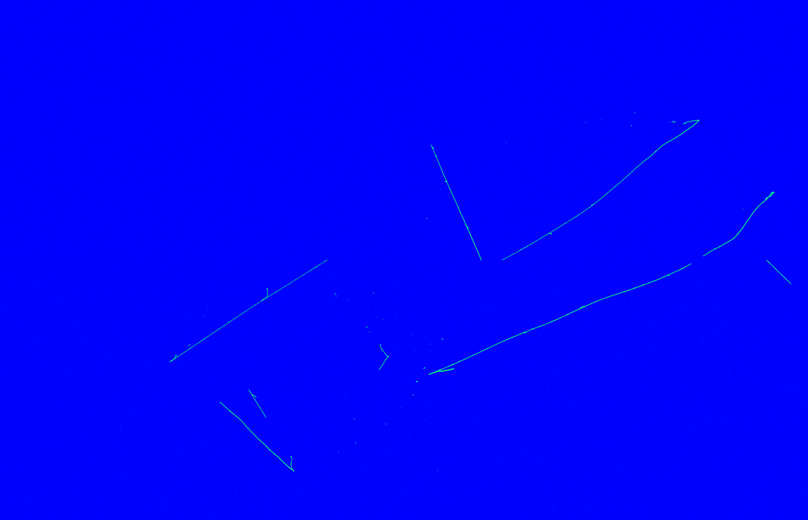
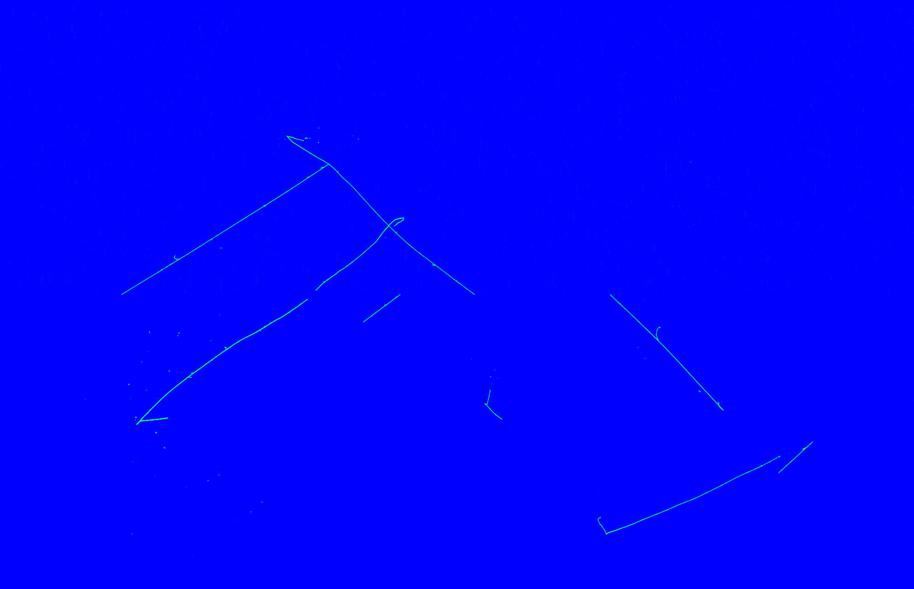
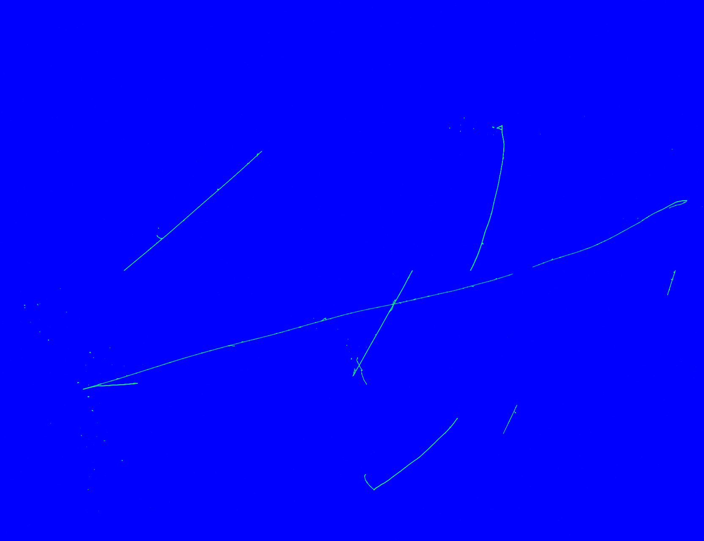
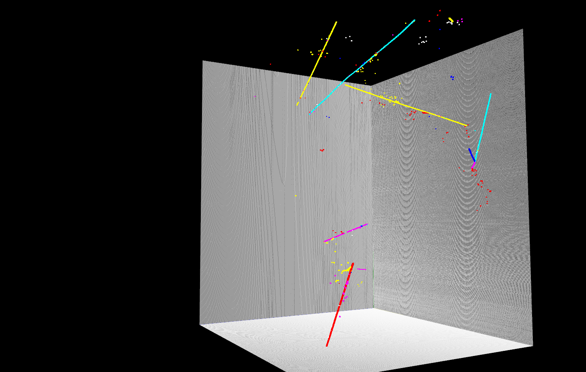
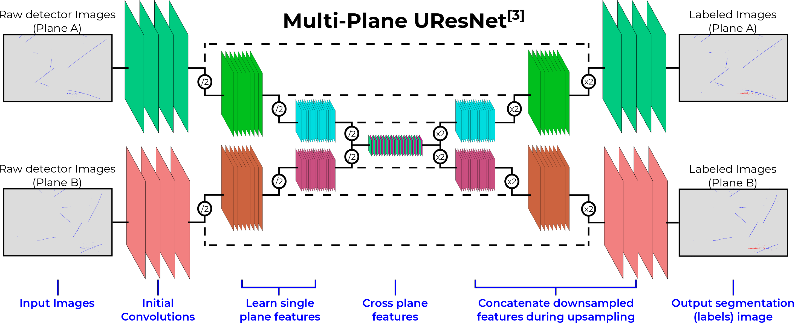
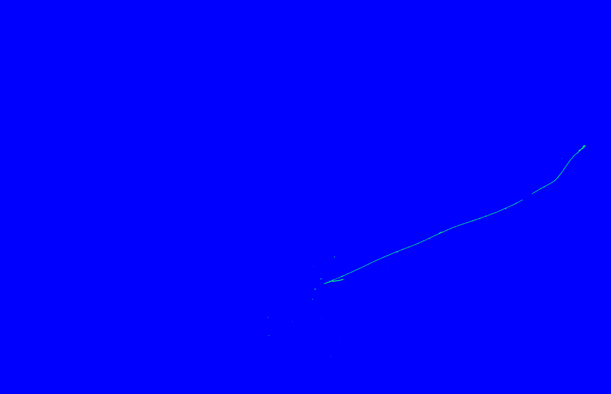
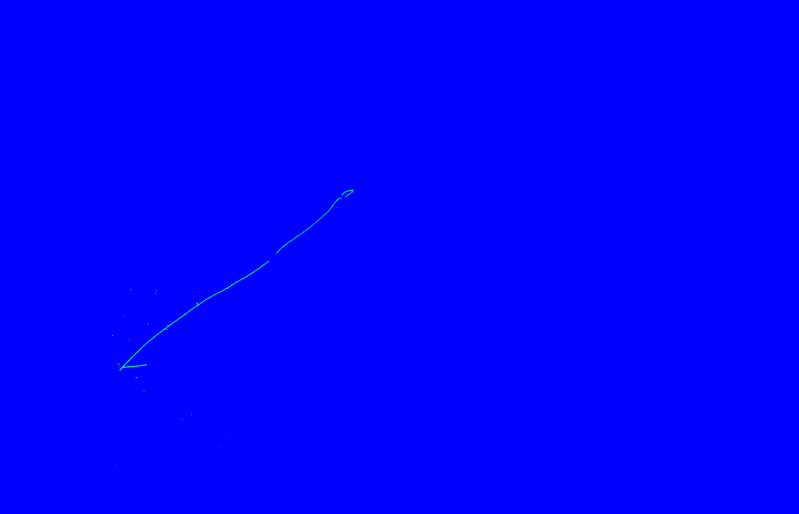
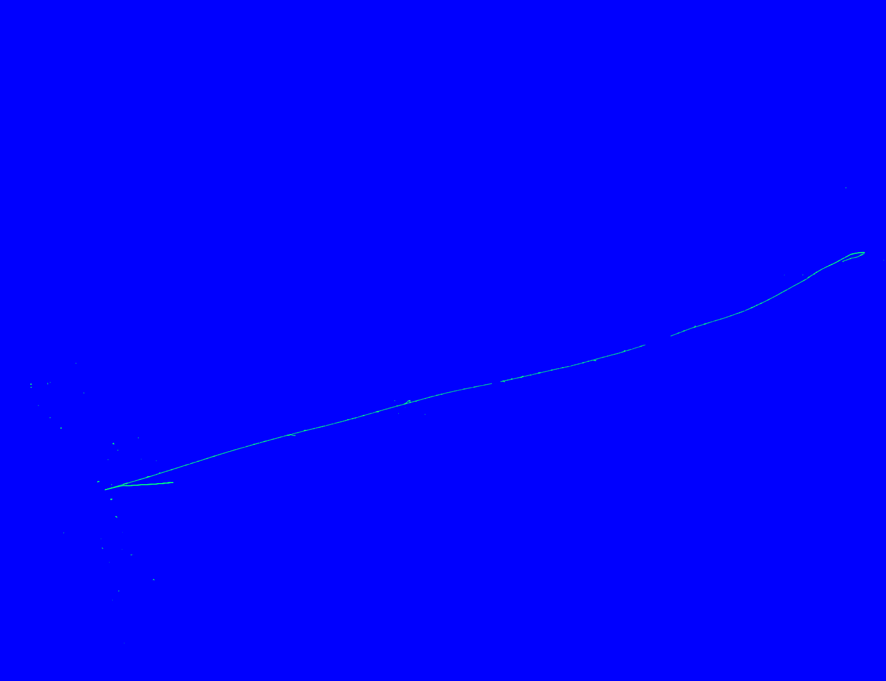

---
# Feel free to add content and custom Front Matter to this file.
# To modify the layout, see https://jekyllrb.com/docs/themes/#overriding-theme-defaults

layout: page
title: Deep Learning
permalink: deep-learning
order: 4
icon: fa-android
---

My current research interests are in the application of deep learning techniques to neutrino detectors.  Traditional pattern recognition methods applied to the images from modern neutrino detectors typically perform poorly on complicated and busy neutrino events.

The application of deep neural networks to neutrino data is quite new in the last several years, in particular the <a href='https://arxiv.org/abs/1604.01444'>NOvA</a> experiment and the <a href='https://arxiv.org/abs/1611.05531'>Microboone</a> experiments are among the first neutrino experiments to adopt deep learning into their analysis.

As a member of Microboone, I am also a leader of the <a href='http://deeplearnphysics.org/'>DeepLearnPhysics</a> group which aims to provide guidance, tools, and expertise to students and researchers who want to apply deep learning to their difficult pattern recognition problems.  We provide open source software development including a data format for fast, threaded IO of sparse particle physics data, visualization tools, and many implementations of important deep convolutional networks - see our <a href='https://github.com/DeepLearnPhysics'>github</a> as well as our many <a href='http://deeplearnphysics.org/Blog/'>tutorials</a> and <a href='http://deeplearnphysics.org/DataChallenge/'>open data sets</a>.

Personally, my application of deep learning has been to address some of the hardest problems we face in my research with tools that can be deployed at large scale over millions of neutrino interaction candidates.  One of the projects I am working on currently is cosmogenic background tagging with semantic segmentation, in the <a href='http://sbn-nd.fnal.gov/'>SBND</a> experiment.

The interactions of the SBND detector are flooded with cosmogenic muons that rain down upon the detector.  In particular, because the detector is so slow to read out an interaction, a neutrino can be lost in all of the cosmic rays that also enter the event.  Below, you can see the three different projections of a simulated event with a neutrino and several cosmic muons.

To remove the problem of overlaid cosmics, I developed a deep neural network to label each pixel as either background, neutrino induced, or cosmic induced.  The network is based off of <a href='https://arxiv.org/abs/1505.04597'>U-Net</a> and <a href='https://arxiv.org/abs/1512.03385'>ResNet</a>, though it offers a unique feature for this problem.  Because the neutrino detector gives three projections of the same interaction, it's possible for the network to learn cross plane correlations and infer geometrical properties of the interactions.  For example, cosmic particle enter from the edges of the detector, and the neutrino interaction starts within the detector far from the edges.  In 3D, looking at the simluation information, this is more clear:

The network architecture is then to perform traditional U-Net style upsampling and downsampling, but at the deepest, most abstracted layers the filters from each plane are concatenated together:

As an example of performance, you can see the output on the three images from above, where just the pixels labeled as neutrino have been kept:

This work is currently being prepared for publication.